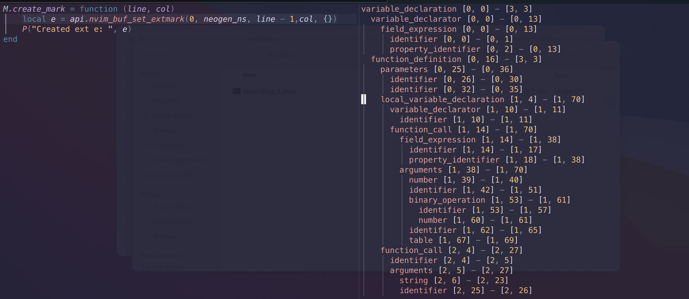

# Adding Languages - Simplified

This sections aims to simplify the languages addition, without exposing you the inner workings of neogen, but only showing you the quickest way to add support to a language.

For this, I will do a very quick recap about the backend concepts of Neogen. Pay very attention to this, because i will explain how the defaults are, so you can use the them.

## Backend Summary

I will use the lua configuration file [here](../lua/neogen/configurations/lua.lua) to explain the inner workings of the backend, so feel free to open a new tab and switch to it regularly.

### Locator

#### Concept

The locator is a function responsible of finding the most appropriate parent for annotation purposes

#### Default Locator

The default locator will fetch the node in current cursor position, and try to go to each parent node recursively until it finds a node name present in `parents[<class|func|type>]`.

Example (with Tree-sitter activated on the side for better comprehension):



The current cursor position is located in the middle of the function (`local_variable_declaration`).

If I generate a function annotation using neogen, the default locator will try to find the first parent node matchinf one of those:

```lua
func = { "function", "local_function", "local_variable_declaration", "field", "variable_declaration" },
```

which will be `variable_declaration`. The parent node will now be this node.

